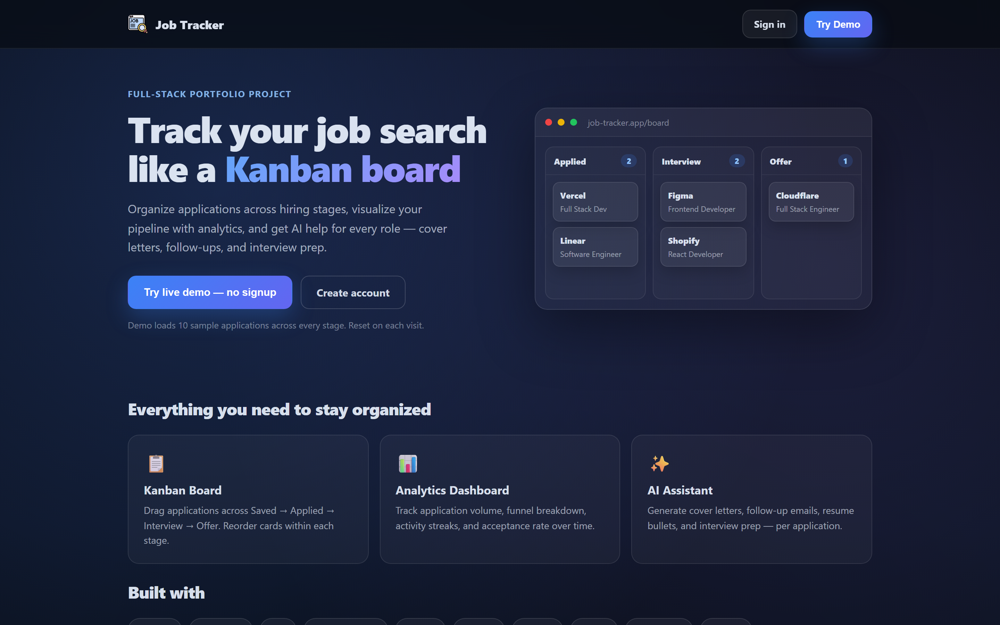
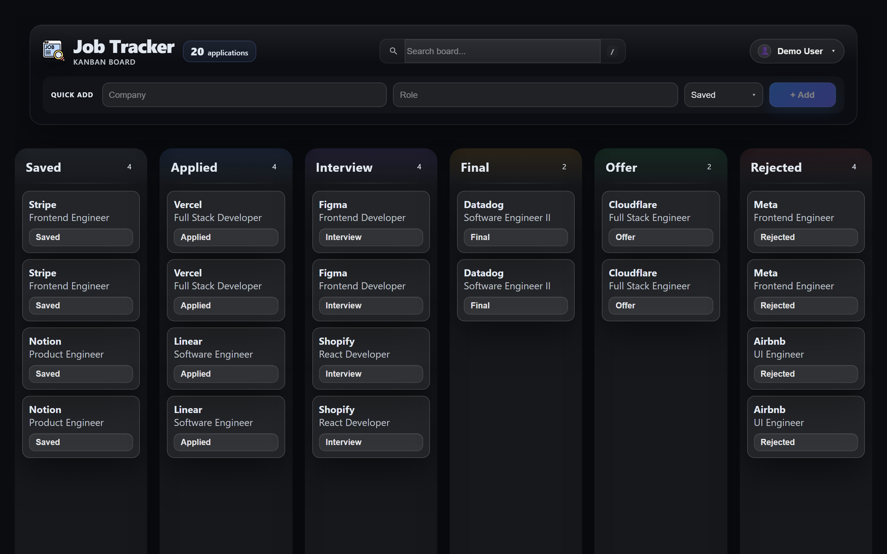
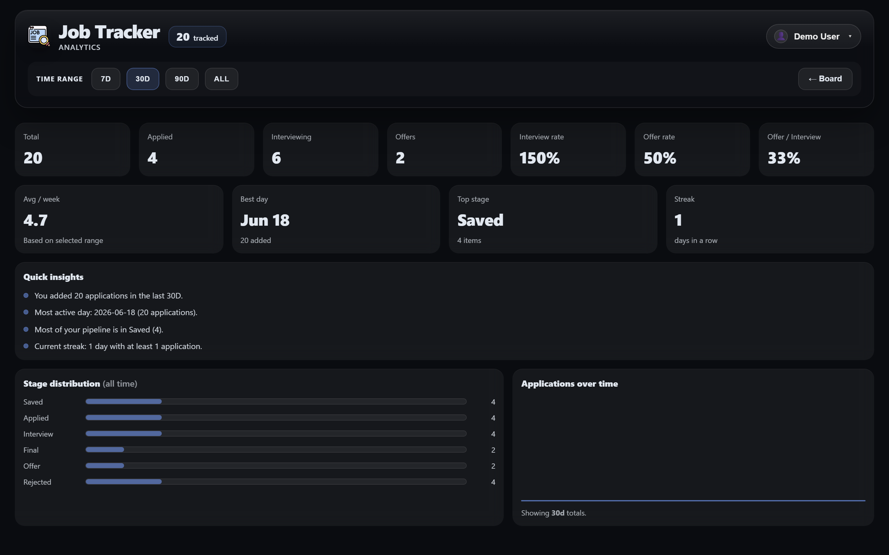

# Job Tracker

A full-stack job application tracker with a drag-and-drop Kanban board, analytics dashboard, and per-application AI writing assistant.

**Live demo:** `https://YOUR_VERCEL_URL.vercel.app` ← replace with your deployed URL  
**Repository:** [github.com/roren06/job-tracker](https://github.com/roren06/job-tracker)  
**Case study:** [CASE_STUDY.md](./CASE_STUDY.md)

## Screenshots

> Add PNGs to [`docs/screenshots/`](./docs/screenshots/) — see that folder for capture instructions.

| Landing | Board | Analytics |
|---------|-------|-----------|
|  |  |  |

## Features

- **Landing page** — Public marketing page with one-click demo (no signup)
- **Kanban board** — Drag applications across Saved → Applied → Interview → Final → Offer → Rejected
- **Analytics** — Funnel breakdown, volume over time, streaks, and conversion rates
- **AI assistant** — Cover letters, follow-up emails, resume bullets, interview tips per application
- **Auth** — Register, login, password reset, and demo mode
- **Dark / light theme** — Persists user preference

## Tech stack

| Layer | Technologies |
|-------|-------------|
| Frontend | React 19, TypeScript, Vite, TanStack Query, React Router, dnd-kit |
| Backend | Node.js, Express, Prisma, PostgreSQL, JWT (httpOnly cookies) |
| AI | OpenAI API with demo fallback when unavailable |
| Deploy | Vercel (client) + Node API + PostgreSQL (Neon) |

## Architecture

```
Browser (React SPA)
    ↓  REST + cookies
Express API
    ↓
Prisma ORM → PostgreSQL
    ↓
OpenAI (optional)
```

## Try the demo

1. Open the live site (or run locally)
2. Click **Try Demo** on the landing page, or go to `/demo`
3. Explore the pre-loaded board, analytics, and AI drawer

Demo data resets on each demo login with 10 sample applications across all stages.

## Local development

### Prerequisites

- Node.js 22+
- PostgreSQL database

### Server

```bash
cd server
npm install
# create .env with DATABASE_URL, JWT_SECRET, CLIENT_URL=http://localhost:5173
npx prisma migrate dev
npm run dev            # http://localhost:4000
```

### Client

```bash
cd client
npm install
# create .env with VITE_API_URL=http://localhost:4000
npm run dev            # http://localhost:5173
```

## Deploy notes

After pushing to GitHub:

- **Vercel** redeploys the client automatically (if connected)
- **API host** (Railway/Render/etc.) redeploys the server — restart if needed
- Set server `CLIENT_URL` to your **HTTPS** frontend URL (e.g. `https://job-tracker.vercel.app`)
- Set client `VITE_API_URL` to your API URL
- Update `og:image` in `client/index.html` to the full HTTPS URL for social previews

## Project structure

```
job-tracker/
├── client/
│   └── src/
│       ├── components/   # AppHeader, ProfileMenu
│       └── pages/        # Board, Analytics, Landing, Auth
├── server/
│   └── src/
│       ├── routes/
│       └── lib/          # seedDemo, cookieOptions
├── docs/screenshots/     # README screenshots
└── CASE_STUDY.md         # Portfolio write-up
```

## Portfolio highlights

- Shared premium header across Board and Analytics
- Optimistic UI for drag-and-drop and card reordering
- Session auth with environment-aware cookie settings
- Soft-delete with undo
- AI generation history per application

## License

MIT
